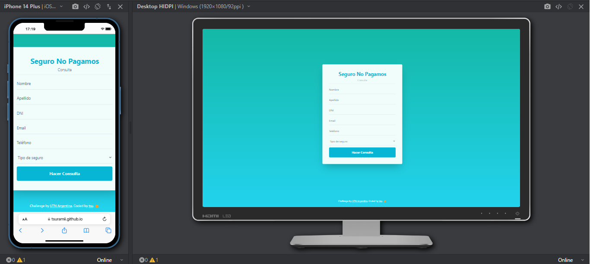
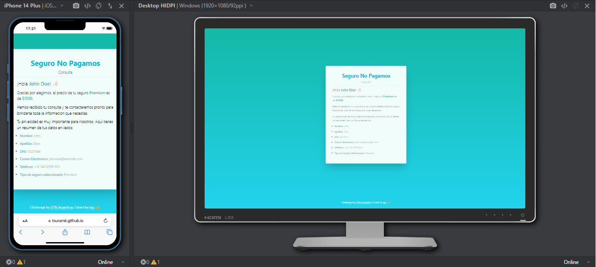

# Seguro No Pagamos Cooperative - Contact Website

This repository contains the solution for an HTML markup and CSS styling exercise for a fictional form for "Seguro No Pagamos Cooperative". The company aims to offer future clients the option to request contact via the web so that an advisor can get in touch with them. The following data should be collected in the form:

- First Name
- Last Name
- ID Number
- Email
- Phone
- Insurance Type

Upon selecting the insurance type (basic, intermediate, premium), the value of each is displayed on the screen:

- Basic: $500
- Intermediate: $1000
- Premium: $1500

## Preview

[Deploy on GitHub Pages](tsuramii.github.io/repaso-reactjs-utn/)

### Screenshot

